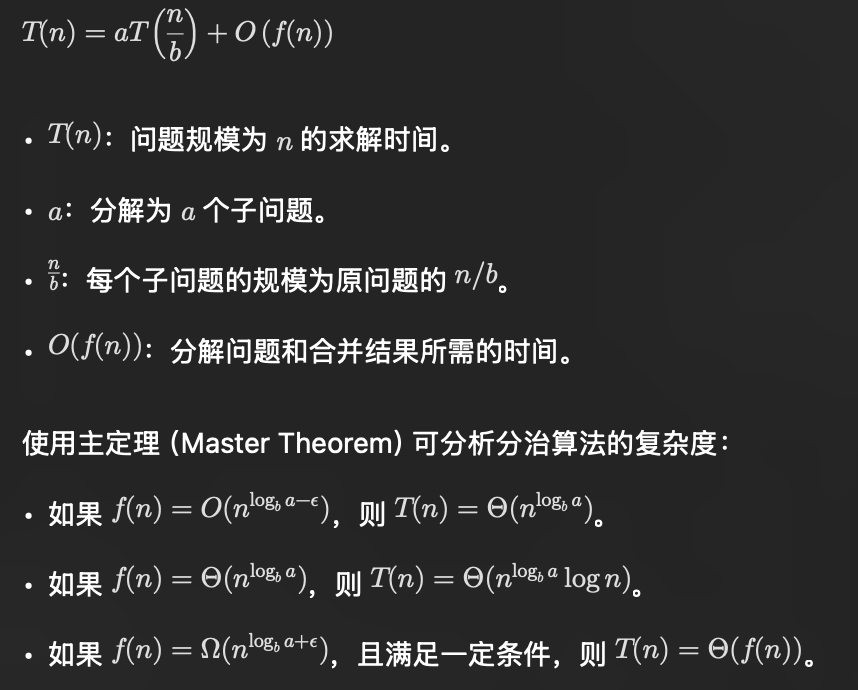
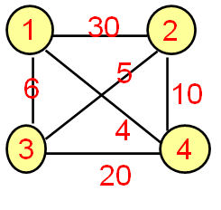
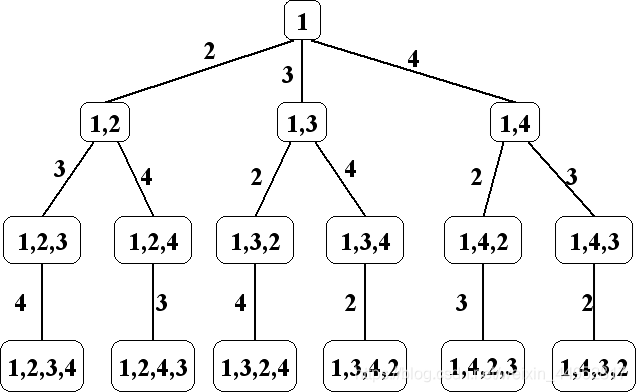
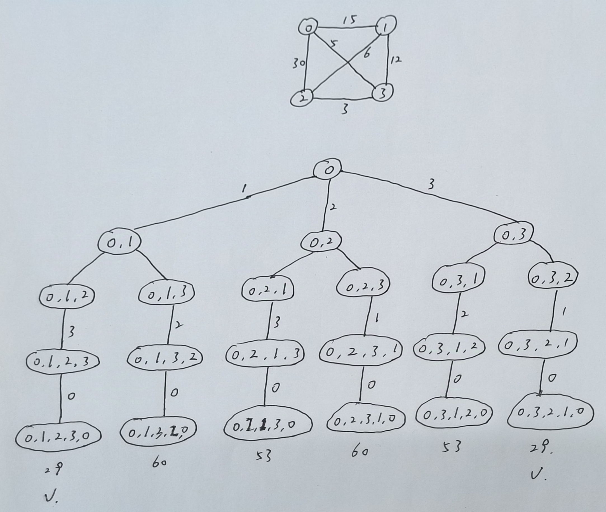
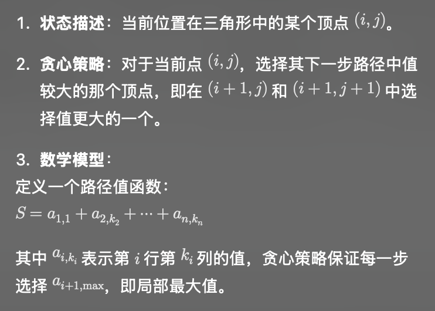
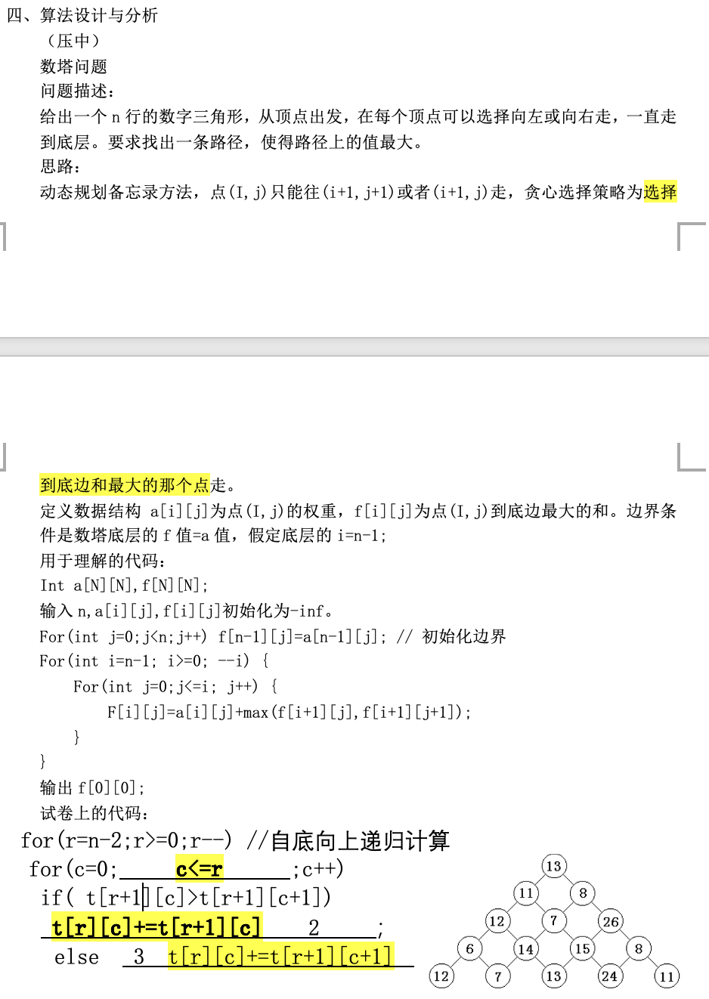

# 一、算法原理探究

回溯算法，动态规划和剪枝算法的数学原理和特征，及其他们如何优化？

### 1. 回溯算法 (Backtracking)
- **数学原理**：
  - 基于**深度优先搜索**(DFS)的思想
  - 通过系统地搜索问题的**所有可能解**来找到所需的解
  - 可以用**决策树**的形式表示搜索空间

- **主要特征**：
  - **递归**实现
  - 维护当前状态
  - 遇到不满足条件时**及时回退**
  - 适合解决排列、组合类问题

- **优化方法**：
  - 合理设计**剪枝条件**
  - 优化状态表示
  - **记忆化搜索**

### 2. 动态规划 (Dynamic Programming)
- **数学原理**：
  - 状态转移方程： f(x) = g(f(x_1), f(x_2), \ldots) ，描述如何从子问题的解构造当前问题的解。
  - 基于**最优子结构**
  - **重叠子问题**
  - **状态转移方程**
  - **无后效性原则**
  
- **主要特征**：
  - **自底向上**求解
  - 存储**中间结果**
  - 通过子问题的最优解构造原问题的最优解

- **优化方法**：
  - **状态压缩**
  - **滚动数组**
  - 空间优化
  - 预处理技术

### 3. 剪枝算法 (Pruning)
- **数学原理**：
  - 基于**可行性**判断
  - 基于**最优性**判断
  - 估价函数

- **主要特征**：
  - 提前**判断无效**分支
  - **减少搜索空间**
  - 常与回溯、分支限界法结合

- **优化方法**：
  - 设计更优的估价函数
  - 合理设计**剪枝条件**
  - 优化判断顺序
  - 使用**启发式规则**

### 4. 分治算法 (Divide and Conquer)

**数学原理**

分治算法（Divide and Conquer）基于递归思想，将一个复杂问题分解为若干个规模较小但结构相似的子问题，递归地解决这些子问题，然后将子问题的解合并，得到原问题的解。其核心数学原理是 **递归分解和合并**，通常用递归方程来描述：

使用**主定理（Master Theorem）**可分析分治算法的复杂度：



**特征**

1. **分解（Divide）**：将问题分解为多个子问题。

2. **解决（Conquer）**：递归地解决子问题。

3. **合并（Combine）**：将子问题的解合并成原问题的解。

4. **递归终止条件（Base Case）**：子问题可以直接求解时结束递归。

**分治算法的优化**

分治算法在实现和性能优化方面有多种策略：

1. **减少重叠计算**（动态规划思想）：
   - 如果不同的子问题有重复计算的部分，可以通过 **备忘录** 或 **动态规划** 来存储并复用计算结果，例如在矩阵链乘法问题中。
   
2. **优化递归深度**：
   - 尽量减少递归深度，如使用尾递归优化，或者在一定规模时切换为非递归算法。
   - 例如快速排序在子数组规模较小时切换到插入排序。
   
3. **并行计算**：
   - 如果子问题独立，可以通过并行处理加速计算，尤其是在多核 CPU 或 GPU 环境下。
   - 如快速傅里叶变换（FFT）可利用并行计算加速。
   
4. **减少分解和合并的开销**：
   - 优化合并阶段的算法，例如归并排序中减少内存复制或直接操作原数组。
   - 使用随机化策略减少最坏情况的发生概率，例如快速排序中随机选择主元。
   
5. **剪枝优化**：

   - 在分解时提前终止无意义的计算。例如在分支限界问题中，提前跳过不可能的分支。

6. **使用缓存（缓存友好）**：
- 通过改变数据访问模式提升缓存命中率，例如对矩阵分块进行分治可以有效利用缓存。

### 综合优化建议
1. **算法选择**：
   - 问题规模小，解空间大：适合回溯
   - 具有重叠子问题：适合动态规划
   - 解空间可预判：适合剪枝

2. **实现优化**：
   - 合理使用数据结构
   - 优化内存访问模式
   - 利用问题特性
   - 合理设计评估函数

3. **混合策略**：
   - 动态规划+记忆化搜索
   - 回溯+剪枝
   - 启发式搜索+剪枝

# 二、程序填空

## 1.回溯解决类TSP问题

### 经典TSP问题

> https://www.acwing.com/blog/content/64377/

#### 问题描述

旅行商问题（Travelling Saleman Problem，TSP），也称为货郎担问题，是一个看似简单，但时间复杂度落在指数时间范围内的难题之一。经典的TSP问题可描述为：一个旅行商在n个城市之间推销商品，从某一个城市A出发，经过其它n-1个城市且仅经过一次，最终回到出发地城市A。现要求给出这样一条路径，且这条路径最短。如果有多个结果只需要给出其中一个结果即可。

算法设计：最小哈密尔顿环

数据输入：第1行输入地点数n，第2行输入地点之间的连线数e，在依次输入两个地点u和v之间的距离w，格式：地点u 地点v 距离w。
数据输出：第一行最短路径，第二行最短路径长度。

#### 数据结构

集合，优先权队列，归约矩阵

#### 算法

LC分支限界法（困难算法）（主要掌握回溯算法），回溯算法

#### 样例输入

```
4 6
0 1 15
0 2 30
0 3 5
1 2 6
1 3 12
2 3 3
```

#### 结果输出

```
29
0 -> 1 -> 3 -> 2 -> 0
```

#### LC分支限界法

```c++
#include <algorithm>
#include <iostream>
#include <queue>
#include <set>
#include <vector>

using namespace std;
const int N = 20, INF = 0x3f3f3f3f;
int path[N], cnt;
set<int> visited;  // 标记数组
int n, m;

class node {
 public:
  int a[N][N];
  int r;  // 归约矩阵的约数
  int u;  // 当前节点的序号
  node() {
    // 无参构造函数
  }
  node(int array[N][N], int u) {
    for (int i = 0; i < n; i++)
      for (int j = 0; j < n; j++) a[i][j] = array[i][j];
    this->u = u;
  }
  node(const node& x) {
    r = x.r;
    u = x.u;
    for (int i = 0; i < n; i++)
      for (int j = 0; j < n; j++) a[i][j] = x.a[i][j];
  }
  node operator=(const node& t) {
    for (int i = 0; i < n; i++)
      for (int j = 0; j < n; j++) a[i][j] = t.a[i][j];
    this->u = t.u;
    this->r = t.r;
    return *this;
  }
  void reduce() {
    this->r = 0;  // 矩阵归约，并计算约数的值
    for (int i = 0; i < n; i++) {
      int res = INF;
      for (int j = 0; j < n; j++) {
        res = min(res, a[i][j]);
      }
      if (res > INF / 2) continue;
      this->r += res;
      for (int j = 0; j < n; j++) {
        if (a[i][j] != INF) a[i][j] -= res;
      }
    }
    for (int i = 0; i < n; i++) {
      int res = INF;
      for (int j = 0; j < n; j++) {
        res = min(res, a[j][i]);
      }
      if (res > INF / 2) continue;
      this->r += res;
      for (int j = 0; j < n; j++) {
        if (a[j][i] != INF) a[j][i] -= res;
      }
    }
  }
};
class PLL {
 public:
  int first;
  node second;
  PLL(int first, node second) : first(first), second(second) {
    // 普通构造函数
  }
  PLL(const PLL& x) {
    this->first = x.first;
    this->second = x.second;
  }
  PLL operator=(const PLL& t) {
    this->first = t.first;
    this->second = t.second;
    return *this;
  }
};
bool cmp(PLL& a, PLL& b) { return a.first > b.first; }
priority_queue<PLL, vector<PLL>, decltype(&cmp)> q(cmp);  // 定义一个小根堆

void bfs() {
  while (!q.empty()) {
    auto t = q.top();
    q.pop();
    int plcost = t.first;
    node pnode(t.second);
    int current = pnode.u;
    path[cnt++] = current;
    if (cnt == n) {
      cout << plcost << endl;
      for (int i = 0; i < n; i++) cout << path[i] << " -> ";
      cout << path[0] << endl;
      return;  // 找到答案节点，直接返回
    }
    // 节点出队后进行标记
    visited.insert(current);
    int tarray[N][N];  // 定义一个临时数组
    for (int i = 0; i < n; i++) {
      if (!visited.count(i)) {
        for (int j = 0; j < n; j++) {
          for (int k = 0; k < n; k++) tarray[j][k] = pnode.a[j][k];
        }
        for (int j = 0; j < n; j++) tarray[current][j] = tarray[j][i] = INF;
        tarray[i][0] = INF;  // 重置规约矩阵
        node sn(tarray, i);
        sn.reduce();
        int clcost = plcost + pnode.a[current][i] + sn.r;
        PLL spll(clcost, sn);
        q.push(spll);
      }
    }
  }
}

int main() {
  cin >> n >> m;
  node start;
  start.u = 0;  // 存储当前节点的序号
  for (int i = 0; i < n; i++) {
    for (int j = 0; j < n; j++) start.a[i][j] = INF;  // 初始化矩阵
  }
  while (m--) {
    int u, v, w;
    scanf("%d%d%d", &u, &v, &w);
    // 针对无向图的TSP问题
    start.a[u][v] = start.a[v][u] = w;
  }
  start.reduce();
  // cout << start.r << endl;
  PLL startpll(start.r, start);
  q.push(startpll);  // 初始化优先权队列
  bfs();
  return 0;
}
```

#### 回溯算法

##### 举例详解

无向带权图如下：



构造解空间树：




按深度优先遍历这棵树，每遍历到一个叶子，就记录小当前的代价，例如，我们进行1-2-3-4-1的路径，其代价为30+5+20+4=59，再回溯到1,2节点处，进行1-2-4-3-1的路径，其代价30+10+20+6=66,66>59，不保留，保留最短路径，以此类推，最后得出最佳答案。

针对上面最开始提出的问题



代码如下

```c++
#include <limits.h>
#include <stdbool.h>
#include <stdio.h>

#define MAX_N 100

void readInput(int *n, int graph[MAX_N][MAX_N]);
void tspBacktracking(int graph[MAX_N][MAX_N], int n,
                     int allMinPaths[MAX_N][MAX_N], int *minCost,
                     int *pathCount);
void backtrack(int graph[MAX_N][MAX_N], int n, int allMinPaths[MAX_N][MAX_N],
               int *minCost, bool visited[MAX_N], int path[MAX_N], int currPos,
               int count, int cost, int *pathCount);

int main() {
  int n;
  int graph[MAX_N][MAX_N];
  readInput(&n, graph);

  int allMinPaths[MAX_N][MAX_N];
  int minCost;
  int pathCount = 0;
  tspBacktracking(graph, n, allMinPaths, &minCost, &pathCount);

  printf("最短路径长度: %d\n", minCost);
  printf("所有最短路径:\n");
  for (int i = 0; i < pathCount; ++i) {
    for (int j = 0; j < n + 1; ++j) {
      printf("%d ", allMinPaths[i][j]);
    }
    printf("\n");
  }

  return 0;
}

void readInput(int *n, int graph[MAX_N][MAX_N]) {
  int e;
  scanf("%d %d", n, &e);
  for (int i = 0; i < *n; ++i) {
    for (int j = 0; j < *n; ++j) {
      graph[i][j] = INT_MAX;
    }
  }
  for (int i = 0; i < e; ++i) {
    int u, v, w;
    scanf("%d %d %d", &u, &v, &w);
    graph[u][v] = w;
    graph[v][u] = w;
  }
}

void tspBacktracking(int graph[MAX_N][MAX_N], int n,
                     int allMinPaths[MAX_N][MAX_N], int *minCost,
                     int *pathCount) {
  bool visited[MAX_N] = {false};
  int path[MAX_N];
  *minCost = INT_MAX;

  visited[0] = true;
  path[0] = 0;
  backtrack(graph, n, allMinPaths, minCost, visited, path, 0, 1, 0, pathCount);
}

void backtrack(int graph[MAX_N][MAX_N], int n, int allMinPaths[MAX_N][MAX_N],
               int *minCost, bool visited[MAX_N], int path[MAX_N], int currPos,
               int count, int cost, int *pathCount) {
  if (count == n && graph[currPos][0] != INT_MAX) {
    int totalCost = cost + graph[currPos][0];
    if (totalCost < *minCost) {
      *minCost = totalCost;
      *pathCount = 0;
      for (int i = 0; i < n; ++i) {
        allMinPaths[*pathCount][i] = path[i];
      }
      allMinPaths[*pathCount][n] = 0;
      (*pathCount)++;
    } else if (totalCost == *minCost) {
      for (int i = 0; i < n; ++i) {
        allMinPaths[*pathCount][i] = path[i];
      }
      allMinPaths[*pathCount][n] = 0;
      (*pathCount)++;
    }
    return;
  }

  for (int i = 0; i < n; ++i) {
    if (!visited[i] && graph[currPos][i] != INT_MAX) {
      visited[i] = true;
      path[count] = i;
      backtrack(graph, n, allMinPaths, minCost, visited, path, i, count + 1,
                cost + graph[currPos][i], pathCount);
      visited[i] = false;
    }
  }
}
```


### 类TSP问题

1. **多旅行商问题（mTSP）**：在这个变体中，有多个旅行商需要访问所有城市，每个城市只能被访问一次，且每个旅行商的路线必须以起点和终点为同一个城市。
2. **有时间窗的TSP（TSPTW）**：每个城市都有一个时间窗，旅行商必须在指定的时间范围内访问每个城市。
3. **带有容量限制的TSP（CVRP）**：旅行商有一个容量限制，通常用于物流和配送问题，旅行商需要在容量限制内完成所有城市的访问。
4. **带有利润的TSP（TSP with Profits）**：每个城市都有一个利润值，旅行商的目标是最大化总利润，而不是最小化总距离。
5. **带有优先级的TSP（Priority TSP）**：每个城市有不同的优先级，旅行商需要按照优先级顺序访问城市。
6. **带有依赖关系的TSP（TSP with Dependencies）**：某些城市之间有访问顺序的依赖关系，必须先访问一个城市才能访问另一个城市。

1.就是将上面的TSP问题更换起点和终点，代码基本上是一样的

5，6就是综合有个顺序问题，画出解空间树容易理解，就是再剔除部分线路（代码层面就是多加几个判断条件）

## 2.动态规划解决序列问题

动态规划能够解决的序列问题如下

1. **最长公共子序列（Longest Common Subsequence, LCS）**：
   - 在两个序列中找到最长的公共子序列。
2. **分割等和子集（Partition Equal Subset Sum）**：
   - 给定一个非负整数数组，判断是否可以将这个数组分割成两个子集，使得两个子集的元素和相等。
3. **子集和问题（Subset Sum Problem）**：
   - 给定一个非负整数数组和一个目标和，判断是否存在一个子集，其元素和等于目标和。
4. **硬币找零（Coin Change）**：
   - 给定不同面额的硬币和一个总金额，计算凑成该总金额所需的最少的硬币个数。
5. **爬楼梯（Climbing Stairs）**：
   - 给定一个楼梯有 `n` 级台阶，每次可以爬 1 级或 2 级，计算有多少种不同的方法可以爬到楼顶。
6. **回文子序列（Palindromic Subsequence）**：
   - 在一个给定的序列中找到最长的回文子序列。
7. **最大子段和 (Maximum subsegment sum)**
   - 找出一个数组中最大连续子数组


### 1. 最长公共子序列（LCS）

```c
#include <stdio.h>
#include <string.h>

int lcs(char *X, char *Y, int m, int n) {
    int L[m + 1][n + 1];

    for (int i = 0; i <= m; i++) {
        for (int j = 0; j <= n; j++) {
            if (i == 0 || j == 0) {
                L[i][j] = 0;
            } else if (X[i - 1] == Y[j - 1]) {
                L[i][j] = L[i - 1][j - 1] + 1;
            } else {
                L[i][j] = (L[i - 1][j] > L[i][j - 1]) ? L[i - 1][j] : L[i][j - 1];
            }
        }
    }

    return L[m][n];
}

int main() {
    char X[] = "AGGTAB";
    char Y[] = "GXTXAYB";
    int m = strlen(X);
    int n = strlen(Y);
    printf("Length of LCS is %d\n", lcs(X, Y, m, n));
    return 0;
}
```

**时间复杂度**：O(m * n)

- 外层循环遍历字符串X：O(m)
- 内层循环遍历字符串Y：O(n)
- 总时间复杂度：O(m) * O(n) = O(m * n)

### 2. 分割等和子集（Partition Equal Subset Sum）

> https://leetcode.cn/problems/partition-equal-subset-sum/
>
> 非常经典的题目，其状态压缩详见官方题解，或者参见下列讲解，本质上和01背包类似（两者状态转移思想是一样的）
>
> https://www.bilibili.com/video/BV1oZ4y1G7QY

```c
class Solution {
    public boolean canPartition(int[] nums) {
        int n = nums.length;
        if (n < 2) {
            return false;
        }
        int sum = 0, maxNum = 0;
        for (int num : nums) {
            sum += num;
            maxNum = Math.max(maxNum, num);
        }
        if (sum % 2 != 0) {
            return false;
        }
        int target = sum / 2;
        if (maxNum > target) {
            return false;
        }
        boolean[][] dp = new boolean[n][target + 1];
        for (int i = 0; i < n; i++) {
            dp[i][0] = true;
        }
        dp[0][nums[0]] = true;
        for (int i = 1; i < n; i++) {
            int num = nums[i];
            for (int j = 1; j <= target; j++) {
                if (j >= num) {
                    dp[i][j] = dp[i - 1][j] | dp[i - 1][j - num];
                } else {
                    dp[i][j] = dp[i - 1][j];
                }
            }
        }
        return dp[n - 1][target];
    }
}
```

**时间复杂度**：O(n * sum)

- 外层循环遍历数组：O(n)
- 内层循环遍历部分和：O(sum)
- 总时间复杂度：O(n) * O(sum) = O(n * sum)

### 3. 子集和问题（Subset Sum Problem）

> 这个题和上个题算是半斤八两了
>
> 算法思维一模一样

```c
#include <stdio.h>
#include <stdbool.h>

bool isSubsetSum(int set[], int n, int sum) {
    bool subset[n + 1][sum + 1];

    for (int i = 0; i <= n; i++) {
        subset[i][0] = true;
    }

    for (int i = 1; i <= sum; i++) {
        subset[0][i] = false;
    }

    for (int i = 1; i <= n; i++) {
        for (int j = 1; j <= sum; j++) {
            if (j < set[i - 1]) {
                subset[i][j] = subset[i - 1][j];
            } else {
                subset[i][j] = subset[i - 1][j] || subset[i - 1][j - set[i - 1]];
            }
        }
    }

    return subset[n][sum];
}

int main() {
    int set[] = {3, 34, 4, 12, 5, 2};
    int sum = 9;
    int n = sizeof(set) / sizeof(set[0]);
    if (isSubsetSum(set, n, sum)) {
        printf("Found a subset with given sum\n");
    } else {
        printf("No subset with given sum\n");
    }
    return 0;
}
```

**时间复杂度**：O(n * sum)

- 外层循环遍历数组：O(n)
- 内层循环遍历部分和：O(sum)
- 总时间复杂度：O(n) * O(sum) = O(n * sum)

### 4. 硬币找零（Coin Change）

```c
#include <stdio.h>
#include <limits.h>

int coinChange(int coins[], int m, int V) {
    int dp[V + 1];
    dp[0] = 0;

    for (int i = 1; i <= V; i++) {
        dp[i] = INT_MAX;
    }

    for (int i = 1; i <= V; i++) {
        for (int j = 0; j < m; j++) {
            if (coins[j] <= i) {
                int sub_res = dp[i - coins[j]];
                // 第二个判断就是最小结果的转移
                if (sub_res != INT_MAX && sub_res + 1 < dp[i]) {
                    dp[i] = sub_res + 1;
                }
            }
        }
    }
    return dp[V] == INT_MAX ? -1 : dp[V];
}

int main() {
    int coins[] = {1, 2, 5};
    int m = sizeof(coins) / sizeof(coins[0]);
    int V = 11;
    printf("Minimum coins required is %d\n", coinChange(coins, m, V));
    return 0;
}
```

**时间复杂度**：O(m * V)

- 外层循环遍历金额：O(V)
- 内层循环遍历硬币：O(m)
- 总时间复杂度：O(V) * O(m) = O(m * V)

### 5. 爬楼梯（Climbing Stairs）

```c
#include <stdio.h>

int climbStairs(int n) {
    if (n == 1) {
        return 1;
    }
    int dp[n + 1];
    dp[1] = 1;
    dp[2] = 2;
    for (int i = 3; i <= n; i++) {
        dp[i] = dp[i - 1] + dp[i - 2];
    }
    return dp[n];
}

int main() {
    int n = 5;
    printf("Number of ways to climb %d stairs is %d\n", n, climbStairs(n));
    return 0;
}
```

**时间复杂度**：O(n)

- 单个循环遍历台阶数：O(n)
- 总时间复杂度：O(n)

### 6. 回文子序列（Palindromic Subsequence）

```c
#include <stdio.h>
#include <string.h>

int max(int a, int b) {
    return (a > b) ? a : b;
}

int longestPalindromicSubsequence(char *str) {
    int n = strlen(str);
    int dp[n][n];

    for (int i = 0; i < n; i++) {
        dp[i][i] = 1;
    }

    for (int cl = 2; cl <= n; cl++) {
        for (int i = 0; i < n - cl + 1; i++) {
            int j = i + cl - 1;
            if (str[i] == str[j] && cl == 2) {
                dp[i][j] = 2;
            } else if (str[i] == str[j]) {
                dp[i][j] = dp[i + 1][j - 1] + 2;
            } else {
                dp[i][j] = max(dp[i][j - 1], dp[i + 1][j]);
            }
        }
    }

    return dp[0][n - 1];
}

int main() {
    char seq[] = "BBABCBCAB";
    printf("The length of the LPS is %d\n", longestPalindromicSubsequence(seq));
    return 0;
}
```

**时间复杂度**：O(n^2)

- 外层循环遍历子序列长度：O(n)
- 内层循环遍历子序列起始位置：O(n)
- 总时间复杂度：O(n) * O(n) = O(n^2)

### 7. 最大子段和 (Maximum subsegment sum)

> https://leetcode.cn/problems/maximum-subarray/

```c
//在正负相交的数组中找到最大子数组
int maxSubArray(int* nums, int numsSize){
    //动态规划模板题--常见
    int dp[numsSize];
    dp[0]=nums[0];
    int max=dp[0];
    for(int i=1;i<numsSize;i++){
       if(dp[i-1]<=0){
           dp[i]=nums[i];
       }
       else dp[i]=dp[i-1]+nums[i];
       max=dp[i]>max?dp[i]:max;
    }
    return max;
}
//采用dp原因：for循环造成大量重复运算

//dp思想：后面的值取决于前面的值：每次计算不能白算，将最优解（最大解往后面传
```

# 三、算法设计与分析

## 1.算法时间复杂度分析

(与序列相关，故参考上面DP解决序列问题的相关代码即可)

## 2.算法策略的设计和分析

### 1.上台阶问题（DP）

上台阶问题（Climbing Stairs）是一个经典的动态规划问题。问题描述如下：

给定一个楼梯有 `n` 级台阶，每次可以爬 1 级或 2 级，计算有多少种不同的方法可以爬到楼顶。

#### 算法策略设计

1. **定义状态**：
   - 设 `dp[i]` 表示到达第 `i` 级台阶的方法总数。
2. **状态转移方程**：
   - 到达第 `i` 级台阶的方法可以从第 `i-1` 级台阶爬 1 级上来，或者从第 `i-2` 级台阶爬 2 级上来。因此，状态转移方程为： [ dp[i] = dp[i-1] + dp[i-2] ]
3. **初始条件**：
   - 如果只有 1 级台阶，那么只有一种方法，即 `dp[1] = 1`。
   - 如果有 2 级台阶，那么有两种方法：每次爬 1 级，或者一次爬 2 级，即 `dp[2] = 2`。
4. **边界条件**：
   - 当 `i = 0` 时，`dp[0] = 1`，表示从地面到第 0 级台阶的方法数为 1（即不动）。

#### 动态规划解决方案

```c
#include <stdio.h>

int climbStairs(int n) {
    if (n == 1) {
        return 1;
    }
    int dp[n + 1];
    dp[0] = 1;
    dp[1] = 1;
    dp[2] = 2;
    for (int i = 3; i <= n; i++) {
        dp[i] = dp[i - 1] + dp[i - 2];
    }
    return dp[n];
}

int main() {
    int n = 5;
    printf("Number of ways to climb %d stairs is %d\n", n, climbStairs(n));
    return 0;
}
```

#### 时间复杂度分析

- **时间复杂度**：O(n)
  - 该算法使用一个循环从 3 到 n 计算每一级台阶的方法数，因此时间复杂度为 O(n)。
- **空间复杂度**：O(n)
  - 该算法使用一个大小为 n+1 的数组来存储每一级台阶的方法数，因此空间复杂度为 O(n)。

### 2.电梯上下楼问题（贪心）

> 其他策略修改点也在于贪心处，例如：同向优先，同向最远距离优先；		

#### 问题描述

> 下面这个问题是电梯同时处理单个请求，就是电梯里面只能承载一个人

电梯在一栋楼内运行，楼层从1到N。电梯需要处理一系列的请求，每个请求包含一个起始楼层和目标楼层。电梯需要决定如何处理这些请求，以最小化总的移动距离或时间。

#### 贪心算法策略

贪心算法的核心思想是每一步都选择当前最优解，从而希望最终得到全局最优解。对于电梯问题，可以采用以下贪心策略：

1. **同方向优先**：电梯在当前方向上尽可能多地处理请求，直到没有更多请求，然后改变方向。
2. **最近请求优先**：在当前方向上，优先处理距离最近的请求。

这个问题的贪心策略大致如下：

1. **最近请求优先策略（Nearest Request First, NRF）**：
   - 电梯总是选择当前方向上最近的请求进行处理。这种策略可以减少电梯的移动距离，提高效率。
2. **电梯调度算法（Elevator Algorithm, SCAN）**：
   - 电梯在一个方向上移动，直到没有更多的请求，然后改变方向。这种策略可以确保电梯不会频繁改变方向，适用于请求较为均匀分布的情况。
3. **循环扫描算法（Circular SCAN, C-SCAN）**：
   - 电梯在一个方向上移动，直到没有更多的请求，然后直接返回起始点，继续处理请求。这种策略可以确保电梯在每个方向上都能公平地处理请求。
4. **LOOK算法**：
   - 类似于SCAN算法，但电梯只移动到有请求的地方，然后改变方向，而不是移动到最远的端点。
5. **C-LOOK算法**：
   - 类似于C-SCAN算法，但电梯只移动到有请求的地方，然后直接返回起始点，继续处理请求。

#### 具体步骤

1. **初始化**：设定电梯的初始位置和方向（例如，从1楼开始，向上）。
2. 处理请求：
   - 在当前方向上，找到所有请求中距离最近的一个，处理该请求。
   - 更新电梯的位置和方向。
3. **改变方向**：如果当前方向上没有更多请求，改变电梯的方向。
4. **重复**：重复步骤2和3，直到所有请求都被处理完。

```c
#include <limits.h>
#include <stdio.h>
#include <stdlib.h>

typedef struct {
  int start;
  int end;
} Request;

void elevator_schedule(Request requests[], int n, int initial_floor) {
  int current_floor = initial_floor;
  int direction = 1;  // 1 for up, -1 for down
  int processed[n];
  for (int i = 0; i < n; i++) {
    processed[i] = 0;
  }

  while (1) {
    int next_request_index = -1;
    int min_distance = INT_MAX;

    // 找到当前方向上最近的请求
    for (int i = 0; i < n; i++) {
      if (!processed[i]) {
        int start = requests[i].start;
        if ((direction == 1 && start >= current_floor) ||
            (direction == -1 && start <= current_floor)) {
          int distance = abs(start - current_floor);
          if (distance < min_distance) {
            min_distance = distance;
            next_request_index = i;
          }
        }
      }
    }

    if (next_request_index != -1) {
      // 处理找到的请求
      int start = requests[next_request_index].start;
      int end = requests[next_request_index].end;
      printf("Processing request from floor %d to floor %d\n", start, end);
      current_floor = end;
      processed[next_request_index] = 1;
    } else {
      // 改变方向
      direction *= -1;
      // 检查是否所有请求都已处理
      int all_processed = 1;
      for (int i = 0; i < n; i++) {
        if (!processed[i]) {
          all_processed = 0;
          break;
        }
      }
      if (all_processed) {
        break;
      }
    }
  }
}

int main() {
  Request requests[] = {{1, 5}, {3, 7}, {4, 2}, {6, 8}, {7, 3}};
  int n = sizeof(requests) / sizeof(requests[0]);
  int initial_floor = 1;

  elevator_schedule(requests, n, initial_floor);

  return 0;
}
```

#### 分析

- **时间复杂度**：每次选择最近请求的操作需要遍历所有请求，时间复杂度为O(n^2)，其中n是请求的数量。
- **空间复杂度**：需要存储请求列表和调度结果，空间复杂度为O(n)。

#### 优化

可以使用优先队列（堆）来优化选择最近请求的操作，将时间复杂度降低到O(n log n)。

#### 总结

贪心算法通过每次选择当前最优解，可以有效地解决电梯上下楼问题，虽然不能保证全局最优解，但在大多数情况下表现良好。

#### SCAN算法

```c
#include <stdio.h>
#include <stdlib.h>

typedef struct {
  int start;
  int end;
} Request;

int compare_up(const void *a, const void *b) {
  return ((Request *)a)->start - ((Request *)b)->start;
}

int compare_down(const void *a, const void *b) {
  return ((Request *)b)->start - ((Request *)a)->start;
}

void elevator_schedule(Request requests[], int n, int initial_floor) {
  int current_floor = initial_floor;
  int direction = 1;  // 1 for up, -1 for down
  Request up_requests[n];
  Request down_requests[n];
  int up_count = 0, down_count = 0;

  // 将请求分为向上和向下的请求
  for (int i = 0; i < n; i++) {
    if (requests[i].start >= current_floor) {
      up_requests[up_count++] = requests[i];
    } else {
      down_requests[down_count++] = requests[i];
    }
  }

  // 按楼层排序请求
  qsort(up_requests, up_count, sizeof(Request), compare_up);
  qsort(down_requests, down_count, sizeof(Request), compare_down);

  while (up_count > 0 || down_count > 0) {
    if (direction == 1) {
      // 处理向上的请求
      for (int i = 0; i < up_count; i++) {
        printf("Processing request from floor %d to floor %d\n",
               up_requests[i].start, up_requests[i].end);
        current_floor = up_requests[i].end;
      }
      up_count = 0;    // 清空向上的请求
      direction = -1;  // 改变方向
    } else {
      // 处理向下的请求
      for (int i = 0; i < down_count; i++) {
        printf("Processing request from floor %d to floor %d\n",
               down_requests[i].start, down_requests[i].end);
        current_floor = down_requests[i].end;
      }
      down_count = 0;  // 清空向下的请求
      direction = 1;   // 改变方向
    }
  }
}

int main() {
  Request requests[] = {{2, 5}, {8, 3}, {6, 7}, {4, 1}};
  int n = sizeof(requests) / sizeof(requests[0]);
  int initial_floor = 3;

  elevator_schedule(requests, n, initial_floor);

  return 0;
}
```


# 四、算法设计

## 题目描述

关于树塔/树状（一棵树，塔型结构或者图型结构）

1.哪条线路的数据流最大或最小

2.评价某个形式，达到怎样的量

类C语言实现，可以是伪代码

要解决这个问题，我们可以使用深度优先搜索（DFS）算法来遍历树，并计算每条路径的流量。我们可以假设每条边都有一个权重，表示数据流量。

## 解决方案

以下是一个伪代码示例，展示如何找到树中数据流最大的路径：

```c
#include <stdio.h>
#include <stdlib.h>
#include <limits.h>

#define MAX_NODES 100

typedef struct Node {
    int id;
    int weight;
    struct Node* next;
} Node;

Node* graph[MAX_NODES];
int visited[MAX_NODES];
int maxFlow = INT_MIN;

void addEdge(int u, int v, int weight) {
    Node* node = (Node*)malloc(sizeof(Node));
    node->id = v;
    node->weight = weight;
    node->next = graph[u];
    graph[u] = node;
}

void dfs(int node, int currentFlow) {
    visited[node] = 1;
    Node* temp = graph[node];
    while (temp != NULL) {
        if (!visited[temp->id]) {
            int newFlow = currentFlow + temp->weight;
            if (newFlow > maxFlow) {
                maxFlow = newFlow;
            }
            dfs(temp->id, newFlow);
        }
        temp = temp->next;
    }
    visited[node] = 0;
}

int main() {
    int n, u, v, weight;
    printf("Enter number of edges: ");
    scanf("%d", &n);

    for (int i = 0; i < n; i++) {
        printf("Enter edge (u v weight): ");
        scanf("%d %d %d", &u, &v, &weight);
        addEdge(u, v, weight);
        addEdge(v, u, weight); // Assuming undirected graph
    }

    dfs(0, 0); // Assuming 0 is the root node

    printf("Maximum data flow in the tree: %d\n", maxFlow);

    return 0;
}
```

这个伪代码实现了以下步骤：
1. 使用邻接表表示树。
2. 使用深度优先搜索（DFS）遍历树。
3. 计算每条路径的流量，并更新最大流量。

你可以根据需要修改代码以适应具体的需求，例如计算最小流量或评价某个形式。

## 实际考题

> 一个很简单的自底向上的状态转移，注意其思路上的描述

数学原理：





# 五、算法应用

从所有课题中随机抽取

- 什么问题
- 什么算法
- 算法分析
- 问题解决
